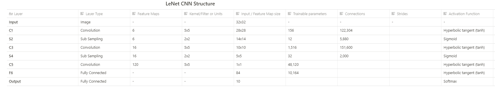

# This repo will introduce the LeNet-5 CNN architecture as described in the original paper, along with the implementation of the architecture using TensorFlow 2.0.

Study: GradientBased Learning Applied to Document Recognition

## Link to original paper: http://vision.stanford.edu/cs598_spring07/papers/Lecun98.pdf
 

## LeNet-5
LeNet-5 CNN architecture is made up of 7 layers. The layer composition consists of 3 convolutional layers, 2 subsampling layers and 2 fully connected layers.

 

 

Below is a table that summarises the key features of each layer
 

 

## Dataset
MNIST dataset using the keras library

## Description
In the original paper where the LeNet-5 architecture was introduced, subsampling layers were utilized. Within the subsampling layer the average of the pixel values that fall within the 2x2 pooling window was taken, after that, the value is multiplied with a coefficient value. A bias is added to the final result, and all this is done before the values are passed through the activation function.
But in our implemented LeNet-5 neural network, we’re utilizing the tf.keras.layers.AveragePooling2D constructor.

There are two more types of layers within the network, the flatten layer and the dense layers.
The flatten layer is created with the class constructor tf.keras.layers.Flatten.
The purpose of this layer is to transform its input to a 1-dimensional array that can be fed into the subsequent dense layers.
The dense layers have a specified number of units or neurons within each layer, F6 has 84, while the output layer has ten units.
The last dense layer has ten units that correspond to the number of classes that are within the MNIST dataset. The activation function for the output layer is a softmax activation function.

Now we can compile and build the model.

To train the network, we utilize a loss function that calculates the difference between the predicted values provided by the network and actual values of the training data.

The loss values accompanied by an optimization algorithm(Adam) facilitates the number of changes made to the weights within the network. Supporting factors such as momentum and learning rate schedule, provide the ideal environment to enable the network training to converge, herby getting the loss values as close to zero as possible.
During training, we’ll also validate our model after every epoch with the valuation dataset partition created earlier.

After training, you will notice that your model achieves a validation accuracy of over 90%. But for a more explicit verification of the performance of the model on an unseen dataset, we will evaluate the trained model on the test dataset partition created earlier.

After training my model, I was able to achieve 98% accuracy on the test dataset, which is quite useful for such a simple network.